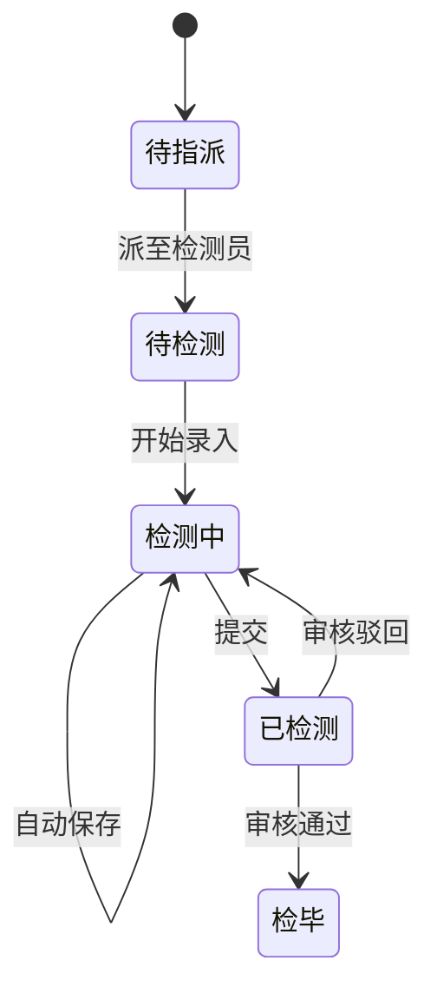

# 通信铁塔检测系统 · 产品需求文档（PRD）

> **文档格式说明**：本文档按飞书产品需求文档常用结构编写（参考：[飞书 PRD 模板](https://my.feishu.cn/docx/SwQgdUibJowb26xiP9RcTIdWncc)）。内容来源于已确认原型 `workspace/prototype/` 及内部 PRD V3.4，供评审、研发与测试使用。

---

## 一、文档信息

| 项目 | 内容 |
| --- | --- |
| 产品名称 | 通信铁塔检测系统 |
| 文档版本 | V1.0（飞书版） |
| 编制日期 | 2026-05-16 |
| 编制单位 | 浙江中能工程检测有限公司 |
| 密级 | 内部文件 · 机密 |
| 适用端 | PC 管理后台 · 移动端 APP · iPad 平板端（横屏） |
| 关联原型 | PC：`prototype/index.html`；APP：`prototype/app-index.html`；iPad：`prototype/ipad-index.html` |
| 关联文档 | `workspace/docs/prd.md`（技术详版 V3.4） |

### 1.1 修订记录

| 版本 | 日期 | 修订人 | 修订说明 |
| --- | --- | --- | --- |
| V1.0 | 2026-05-16 | 产品经理 | 初版：按飞书 PRD 结构整理；对齐原型 V3.4（模板字段配置、数值序列默认值、iPad 填报方案 B） |

### 1.2 评审记录（待填）

| 评审日期 | 参与人 | 结论 | 遗留问题 |
| --- | --- | --- | --- |
| — | — | — | — |

---

## 二、名词解释

| 术语 | 说明 |
| --- | --- |
| 模板包 | 一套完整的检测任务表单定义（模块树 + 字段 + 规则），按塔型/业务线匹配 |
| 模板快照 | 任务开启时锁定的模板版本 JSON，在办任务不受后台改版影响 |
| 标准值 | 单项录入字段（一个指标一格） |
| 二维表 | 矩阵类录入：首列行标签 × 多列表头 |
| 序列生成默认值 | 数字字段按「平均值 ± 范围 + 个数」自动生成一串参考值 |
| 方案 B | iPad 检测填报：左侧模块导航 + 右侧 iframe 内嵌子页 |
| embed 模式 | 子页 URL 带 `embed=1`，隐藏独立顶栏/底栏，由主页承载导航 |
| 记录版本 VN | 检测数据每次提交或 PC 审核修订产生的可追溯版本链 |
| 塔型唯一性 | 一种塔型在同一时刻仅允许一套「已发布」检测模板 |

---

## 三、需求背景

### 3.1 业务背景

通信铁塔结构安全检测业务链路长：**合同签订 → 工程建档 → 订单派单 → 外协检测单位执行 → 现场采集 → 技术审核 → 报告编制与签发 → 归档交付**。当前大量环节依赖 Excel、纸质原始记录与口头协同，存在数据重复录入、模板不统一、现场弱网体验差、审核改数难追溯等问题。

### 3.2 产品现状（建设目标）

建设 **B 端一体化系统**，实现：

1. 主数据与商务、检测、报告在同一平台闭环；
2. **PC 配置「测什么」**，现场端（APP / iPad）按模板快照 **「怎么填」**；
3. 现场支持离线草稿、自动保存、全量校验后提交锁定；
4. PC 审核改数 **保留原文**、支持 **记录版本** 追溯。

### 3.3 参考来源

| 来源 | 说明 |
| --- | --- |
| 飞书《产品评审》 | 合同、订单、客户、工程、外协模型 |
| 飞书《检测任务》 | 开启向导、分模块填报、语音备忘、拍照识别、提交锁定 |
| 飞书存量铁塔原始记录附表 | 单管/角线杆、角钢/格构两套结构实例 |
| HTML 原型 V3.4 | 已确认交互与页面范围 |

---

## 四、需求目标

| 序号 | 目标 | 衡量方式 |
| --- | --- | --- |
| G1 | 流程线上化 | 合同→报告主链路系统内完成率 |
| G2 | 数据一次录入、多处复用 | 报告抬头自动带出率；减少重复字段录入 |
| G3 | 模板可配置、可版本化 | 新塔型通过配置上线，无需改代码发版 |
| G4 | 现场弱网可用 | 离线草稿 + 同步队列成功率 |
| G5 | 责任可追溯 | 提交/审核/改派/撤单留痕；记录版本可查询 |
| G6 | 多终端一致 | PC / APP / iPad 共用任务快照与业务规则 |

---

## 五、需求范围

### 5.1 本期范围（In Scope）

| 端 | 范围摘要 |
| --- | --- |
| **PC** | 合同、营销、工程、订单、检测管理、报告、模板中心（含字段级配置）、基础数据、工作台 |
| **APP** | 登录、工作台、开启检测向导、分模块填报、语音备忘、拍照识别、同步 |
| **iPad** | 横屏工作台、开启向导、**填报主页方案 B**、专项模块（防腐/焊接/连接）、同步、校验、订单地图 |

### 5.2 本期不做（Out of Scope）

| 项 | 说明 |
| --- | --- |
| 设备出入库 / 设备台账 | 按调研结论移除，若回归走变更单 |
| 独立天线管理模块 | 天线数据挂在站点下 |
| 塔段样式管理 | 研究课题，不纳入本期里程碑 |
| 领导驾驶舱大屏 | 另见 `screen/01-screenPRD.md` |

### 5.3 需求列表总览

| 需求 ID | 模块 | 需求名称 | 优先级 | 端 |
| --- | --- | --- | --- | --- |
| R-001 | 合同管理 | 合同主档、单价、收付款提醒与登记 | P0 | PC |
| R-002 | 订单管理 | 订单维护、派单、改派、催办 | P0 | PC |
| R-003 | 营销/工程 | 客户架构树、工程建档 | P0 | PC |
| R-004 | 检测管理 | 任务分派、数据复核、记录版本 | P0 | PC |
| R-005 | 报告管理 | 编制、多级审核、加签 | P0 | PC |
| R-006 | 模板中心 | 任务模板包 + **字段级配置** | P0 | PC |
| R-006-1 | 模板中心 | **数值字段序列生成默认值** | P0 | PC |
| R-007 | 基础数据 | 检测单位、设备、站点、字典 | P1 | PC |
| R-008 | 现场作业 | 开启检测任务三步向导 | P0 | APP/iPad |
| R-009 | 现场作业 | 分模块填报、保存/提交/锁定 | P0 | APP/iPad |
| R-010 | 现场作业 | 语音备忘、拍照识别、Word 导出 | P1 | APP |
| R-011 | iPad | **检测填报主页方案 B**（左导航+右内嵌） | P0 | iPad |
| R-012 | iPad | 数据同步、数据校验、订单地图 | P0 | iPad |
| R-013 | iPad | 防腐层 / 焊接 / 连接质量专项页 | P0 | iPad |

---

## 六、用户角色

| 角色 | 职责 | 主要使用端 |
| --- | --- | --- |
| 营销人员 | 客户、工程主数据 | PC |
| 合同部人员 | 合同、订单、派单、催办 | PC |
| 检测单位管理员 | 组织、派工、转派、接单 | PC |
| 现场检测人员 | 现场采集、提交 | APP / **iPad** |
| 技术部主管 | 检测数据审核 | PC |
| 报告编制/审核人 | 报告编制与审批 | PC |
| 系统管理员 | 模板、字典、权限 | PC |

---

## 七、业务流程

### 7.1 核心业务主流程

### 7.2 检测任务状态（检测单位视角）

### 7.3 现场检测交互流程（APP / iPad 共用）

**业务规则（摘要）**：

- 提交前可随时手动保存 + 系统自动保存；
- **全部必填项与业务规则校验通过** 后才可提交；
- 提交成功后检测员侧 **不可再改**（驳回后按流程解锁）；
- PC 审核修订 **不覆盖原文**，追加新版本。

---

## 八、功能详细说明

> 以下按 **模块 → 功能点** 描述。每条包含：**功能说明、交互规则、业务规则、异常与边界**（飞书 PRD 常用四维）。

---

### 8.1 【PC】任务模板管理 — 新增/编辑模板

**需求 ID**：R-006  
**原型页面**：`pages/PC端/任务模板配置/任务模板管理/pc_task_template_create.html`

#### 8.1.1 功能说明

管理员配置 **适用塔型** 下的检测任务模板：维护 **检测任务模块树** 及每个模块下的 **字段配置表**。发布后，现场端按模板快照渲染采集表单。

#### 8.1.2 模板基本信息

| 字段 | 是否必填 | 说明 |
| --- | --- | --- |
| 模板名称 | 是 | — |
| 模板编号 | — | 系统自动生成，只读 |
| 适用塔型 | 是 | 单管塔、拉线杆、角钢塔、三管塔、四管塔等 |
| 检测类型 | 是 | 安全性鉴定 / 可靠性鉴定 / 抗震鉴定 |
| 自填版本号 | — | 如 V1.0，只读 |
| 模板说明 | 否 | 用途说明 |

#### 8.1.3 检测任务模块树（左侧）

| 操作 | 交互规则 |
| --- | --- |
| 添加模块 | 在树末尾增加同级根节点，名称可编辑 |
| 添加子模块 | 须在左侧 **选中父节点** 后添加；未选中则提示 |
| 删除模块 | 悬停显示删除，含子节点一并删除 |
| 选中模块 | 右侧字段表切换为当前模块 |

#### 8.1.4 字段配置表（右侧）

| 列名 | 说明 |
| --- | --- |
| 字段名称 | 显示名，必填 |
| 字段编码 | 唯一标识，新建行系统生成 |
| 单位 | 下拉：无、m、mm、cm、μm、kg、kN、MPa、°、% 等 |
| 字段类别 | **标准值** / **二维表** |
| 字段类型 | 文本 / 数字 / 单选 / 多选 / 日期 / 图片 / 坐标 |
| 选项值 | 仅单选、多选可填（逗号或换行） |
| 可选值/值域 | 校验说明，如 ≥0、最长 500 字 |
| 默认值 | 见 §8.2 |
| 行维度 | 二维表首列标签枚举 |
| 列维度 | 二维表表头，多列用「｜」分隔 |
| 必填 | 是否参与提交校验 |
| X/Y 方向排序 | 表单展示顺序 |
| 记录合并 | 合并 / 不合并 |

**业务规则**：

- 字段类别 = **标准值** 时，行/列维度只读「—」；
- 字段类别 = **二维表** 时，须填写行维度、列维度；
- 字段类型 = 单选/多选 时，「选项值」可编辑，否则只读「—」。

#### 8.1.5 发布与塔型唯一性

| 操作 | 规则 |
| --- | --- |
| 保存草稿 | 不校验塔型唯一性 |
| 发布 | 校验塔型、检测类型、至少一个模块与字段；**一塔型仅一套已发布模板**；若冲突须先停用或升级版本 |

#### 8.1.6 异常与边界

| 场景 | 处理 |
| --- | --- |
| 未选中节点点「添加子模块」 | 提示先选中父节点 |
| 发布时塔型已有已发布模板 | 拦截并提示停用或升级 |
| 切换字段类型 | 联动刷新选项值列、默认值列控件 |

---

### 8.2 【PC】数值字段 — 序列生成默认值

**需求 ID**：R-006-1  
**脚本参考**：`assets/pc-template-field-default.js`

#### 8.2.1 功能说明

当字段类型为 **数字** 时，默认值支持两种模式：

| 模式 | 说明 |
| --- | --- |
| 固定值 | 单个默认值文本 |
| **序列生成** | 按平均值、±范围、个数自动生成一串参考值 |

#### 8.2.2 交互规则

1. 「默认值」列顶部下拉选择 **固定值** 或 **序列生成**；
2. 序列生成展示：平均值、±范围、个数（1～99）、**生成** 按钮、只读结果框；
3. 点击 **生成** 后，结果以逗号分隔写入结果框（如 `9, 9.5, 9.6, 9.7, 10, 10.1`）。

#### 8.2.3 生成规则（产品约定）

| 步骤 | 规则 |
| --- | --- |
| 1 | 首值 = 平均值 − 范围（保留 1 位小数） |
| 2 | 末值 = 平均值 + bump，bump = max(0.05, min(范围×15%, 范围×10%+0.05)) |
| 3 | 中间值在首值与平均值之间插值，**必须包含** 平均值 |
| 4 | 中间个数 ≤4 时，按 0.1×范围 步长递近平均值 |

**验收用例**：平均值 `10`、±范围 `1`、个数 `6` → **`9, 9.5, 9.6, 9.7, 10, 10.1`**

#### 8.2.4 运行态建议

二维表多测点场景（如锌层 6 处）：将序列映射为各单元格 **初始参考值**，检测员可逐格修改；提交校验仍以值域与必填为准。

---

### 8.3 【PC】检测管理 — 数据复核与记录版本

**需求 ID**：R-004

#### 8.3.1 功能说明

- **数据复核**：审核人查看并修订已提交检测数据；修订 **追加新版本**，原文快照只读保留。
- **记录版本**：任务列表操作列进入，展示 V1、V2… 版本列表；「详情」打开该版本完整只读记录。

#### 8.3.2 业务规则

| 规则 | 说明 |
| --- | --- |
| 升版时机 | APP 每次成功提交、PC 每次审核修订落库 |
| 检测员锁定 | 提交后检测员不可改，驳回后按意见重填再提交 |
| 版本字段 | 版本号 VN、创建时间、创建人、变更摘要（可选）、详情入口 |

---

### 8.4 【APP】开启检测任务向导

**需求 ID**：R-008

#### 8.4.1 功能说明

检测员开始检测前，经 **三步向导** 确定任务表单实例：

| 步骤 | 内容 |
| --- | --- |
| 1 | 选择塔型（来自站点/工程，只读或受限修改） |
| 2 | 填写塔段数量 N（受模板 max_n 约束） |
| 3 | 选择检测任务模板（仅已发布启用；仅一套时默认选中） |

确认后生成 **模板快照**，进入分模块填报。

#### 8.4.2 业务规则

- 首次实质打开或首次保存塔段数即 **锁定快照**；
- 离线可缓存向导草稿，联网后校验塔型与模板有效性。

---

### 8.5 【APP】分模块填报与便捷能力

**需求 ID**：R-009、R-010

#### 8.5.1 功能说明

按模板 **大模块** 分步录入（基础信息、铁塔照片、整体、基础、地锚、塔段 1…N、平台、防腐、焊接、馈线、连接质量、构件与接地等，**以快照为准**）。

#### 8.5.2 便捷能力

| 能力 | 说明 |
| --- | --- |
| 语音备忘 | 整体级 + 按模块级；支持转写、Word 导出 |
| 拍照识别 | 整体级 + 按模块级；OCR 草稿须人工确认后落库 |
| 保存/提交 | 随时保存 + 自动保存；全量校验通过后提交并锁定 |

---

### 8.6 【iPad】检测填报主页（方案 B）

**需求 ID**：R-011  
**原型页面**：`pages/iPad端/任务/填报主页/ipad_task_inspect_home.html`

#### 8.6.1 功能说明

iPad 横屏（1024×768 基准）下的 **任务级填报壳**：

| 区域 | 内容 |
| --- | --- |
| 顶栏 | 返回、任务标题、**导出**、保存、提交 |
| 左侧约 30% | 总进度条、分组模块导航、上一项/下一项 |
| 右侧约 70% | 当前模块标题 + **iframe** 内嵌子页 |
| 底栏 | 工作台 / 检测 / 我的 |

#### 8.6.2 模块分组（原型固化）

| 分组 | 模块 |
| --- | --- |
| 资料与照片 | 基础信息、上传铁塔照片 |
| 检测大模块 | 整体、基础、地锚、塔段、平台及设备、防腐层质量、焊接、馈线、连接质量、构建质量与接地避雷 |
| 便捷与校验 | 模块语音备忘、模板包分步、校验与提交、同步队列 |

#### 8.6.3 交互规则

| 规则 | 说明 |
| --- | --- |
| 模块菜单 | 仅显示模块名；已完成可显示 **100%** 角标 |
| 无副标题 | 不展示「待填写·…」等状态副标题行 |
| embed | 子页 URL 带 `embed=1&order=`，隐藏子页独立导航 |
| 无全局底栏 | 主页 **不注入**「备忘录/拍照识别」；改顶栏 **导出** |
| 导出 | 弹层选择：导出语音备忘录 / 导出检测任务数据 |

#### 8.6.4 与 APP 差异

| 维度 | APP | iPad |
| --- | --- | --- |
| 布局 | 竖屏 | 横屏，左导航+右内嵌 |
| 导航方式 | 九宫格/跳转均可 | **方案 B 为默认主路径** |
| 主页底栏 | 可有备忘/拍照 | 主页级无，模块内按需保留 |

---

### 8.7 【iPad】数据同步 / 数据校验 / 订单地图

**需求 ID**：R-012

| 页面 | 功能说明 | 原型 | 特殊约定 |
| --- | --- | --- | --- |
| 数据同步 | 上传队列、重试、全部同步 | `ipad_sync_index.html` | 无备忘/拍照底栏 |
| 数据校验 | 提交前必填与规则清单 | `ipad_inspect_validate.html` | 返回填写 / 去提交 |
| 订单地图 | 左列表 + 右地图（Leaflet）联动 | `ipad_order_map.html` | 站点 Marker 与列表选中联动 |

---

### 8.8 【iPad】专项检测子页

**需求 ID**：R-013

| 模块 | 页面 | 形态 |
| --- | --- | --- |
| 防腐层质量 | `ipad_inspect_coating.html` | 二维表 + 照片；可用序列默认值填多格 |
| 焊接 | `ipad_inspect_weld.html` | 检查卡（合格/不合格 + 描述 + 拍照） |
| 连接质量 | `ipad_inspect_connection.html` | 检查卡（螺栓/焊缝等） |

从填报主页 iframe 打开，须带 `embed=1`。

---

### 8.9 【PC】合同 / 订单 / 报告 / 基础数据（摘要）

> 详细规则见 `prd.md` V3.4 §3.2～3.7、§3.9；此处列核心验收点。

| 模块 | 核心验收点 |
| --- | --- |
| 合同管理 | 自有/分包、单价明细、分期收付款提醒与登记 |
| 订单管理 | 编号规则（地址缩写+派单日期+流水）；派单/改派（未指定人员时可改派）/催办置顶 |
| 客户/工程 | 客户架构树最多三级；工程选合同带出客户；省–市 |
| 报告管理 | 检毕复制报告；待编制→编制中→已编制→已出报告；支持加签、批量审核 |
| 基础数据 | 检测单位组织树；设备无出入库；站点名全局唯一；天线挂站点 |

---

## 九、非功能需求

| 类别 | 要求 |
| --- | --- |
| **性能** | PC 列表查询 &lt;1s；APP 本地自动保存 &lt;200ms；报告生成 &lt;5s（常规模板） |
| **安全** | HTTPS；Token 鉴权；接口数据范围校验；审计日志 ≥180 天 |
| **兼容** | PC：Chrome/Edge 90+；APP：iOS 12+ / Android 8+；iPad：横屏 1024×768 基准 |
| **离线** | APP/iPad 离线草稿、联网同步队列、冲突提示 |
| **可配置** | 客户类型、检测类型、规范组、审核链、默认值策略可配置 |

---

## 十、数据说明（核心实体）

| 实体 | 关键字段 | 说明 |
| --- | --- | --- |
| 合同 Contract | 类型、分包比例、含税金额 | 关联客户 |
| 订单 Order | 编号、催办状态、规范组 | 关联工程 |
| 任务 Task | template_package_id、template_version、template_snapshot_json、tower_segment_count | 含快照 |
| 模板字段 TemplateField | field_key、field_type、default_mode、default_seq_*、row_dim、col_dim | 见 §8.1、§8.2 |
| 检测数据版本 TaskDataVersion | version_label、payload_snapshot、source、parent_version_id | 记录版本 |

---

## 十一、项目规划（建议）

| 阶段 | 内容 | 说明 |
| --- | --- | --- |
| 阶段一 | PC 主数据 + 订单派单 + 模板配置 | 含字段表与序列默认值 |
| 阶段二 | APP 开启向导 + 分模块填报 + 提交锁定 | 与模板快照联调 |
| 阶段三 | PC 审核 + 记录版本 + 报告编制 | 版本链与报告引擎 |
| 阶段四 | iPad 方案 B + 专项页 + 同步/校验/地图 | 与 APP 共用 API |
| 阶段五 | 语音备忘、拍照识别、性能与安全加固 | 可按优先级拆分 |

---

## 十二、附录

### 附录 A：原型与需求对照

| 需求 | 原型路径 |
| --- | --- |
| R-006 模板配置 | `pages/PC端/任务模板配置/任务模板管理/pc_task_template_create.html` |
| R-001 消息模板（合同/任务提醒） | `pages/PC端/消息模板配置/消息模板管理/pc_message_template_list.html` |
| R-001 对上合同详情 | `pages/PC端/合同管理/合同编辑/pc_contract_detail.html` |
| R-006-1 序列默认值 | `assets/pc-template-field-default.js` |
| R-011 填报主页 | `pages/iPad端/任务/填报主页/ipad_task_inspect_home.html` |
| R-012 同步/校验/地图 | `pages/iPad端/系统/同步/ipad_sync_index.html` 等 |
| R-013 专项页 | `pages/iPad端/检测/防腐层|焊接|连接/*.html` |

### 附录 B：飞书参考文档

| 文档 | 链接 |
| --- | --- |
| PRD 格式参考（本文结构来源） | https://my.feishu.cn/docx/SwQgdUibJowb26xiP9RcTIdWncc |
| 产品评审 | https://my.feishu.cn/docx/Q4kxdBIaTofKmkx1cFHcjm1Qnhg |
| 检测任务 | https://my.feishu.cn/docx/Nsf8dExeLo7GjmxRPLicgtUwn0c |
| 单管塔附表 | https://my.feishu.cn/docx/Tr6WduMX6ocXJ7xPGk4cq9OnnqL |
| 角钢塔附表 | https://my.feishu.cn/docx/WlMed0mhJo9acdxF31XcmkzwnUh |

### 附录 C：开放问题（待评审）

| 编号 | 问题 | 建议决策方 |
| --- | --- | --- |
| Q1 | 飞书原文档 § 格式细节是否与本文完全一致（需打开参考链核对） | 产品负责人 |
| Q2 | APP 是否同步采用 iPad 方案 B 作为主路径 | 产品 + 研发 |
| Q3 | 序列默认值在报告占位符中的映射规则 | 产品 + 报告引擎 |

---

**文档结束**

浙江中能工程检测有限公司 · 内部文件 · 机密
