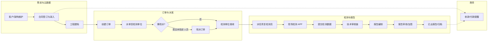
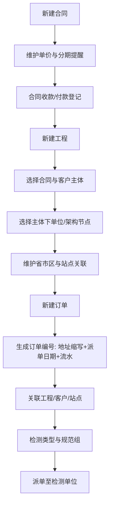
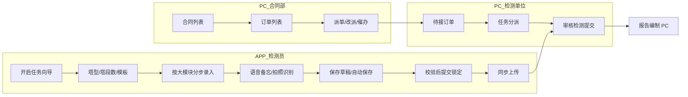
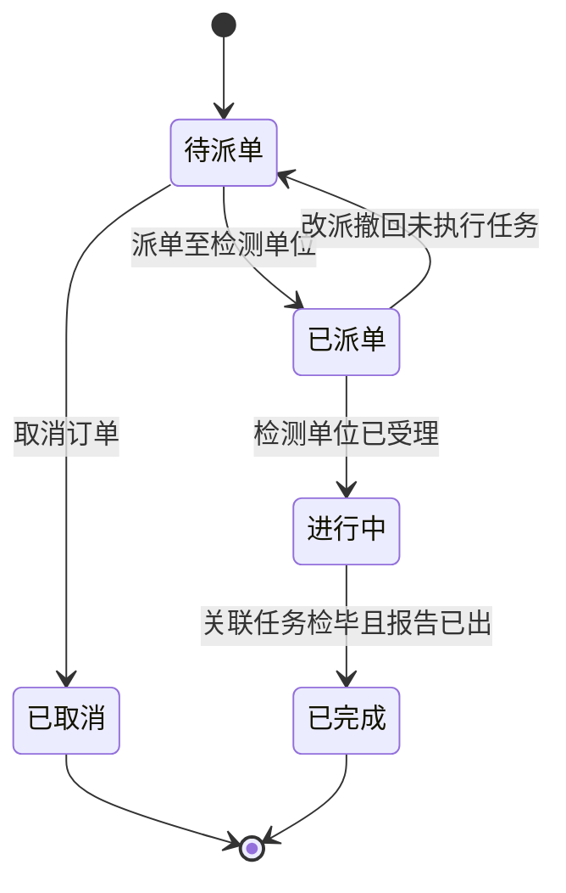
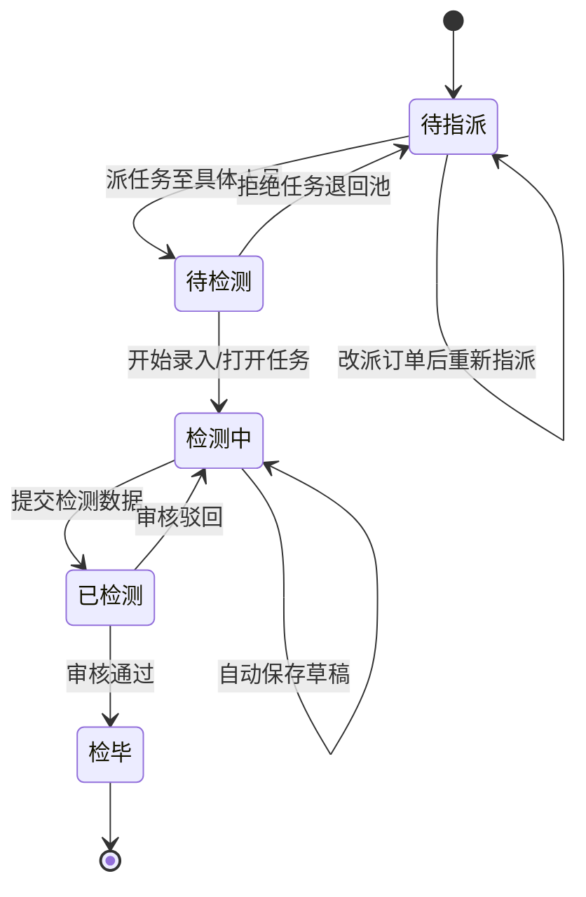
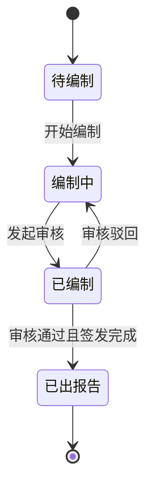
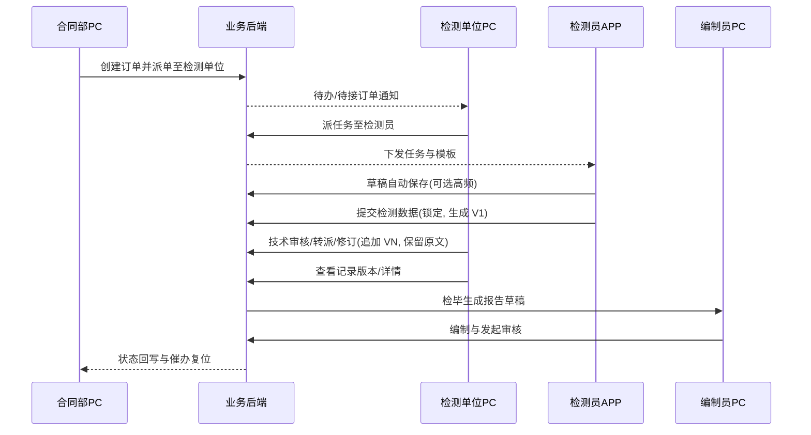

通信铁塔检测系统

产品需求文档 PRD

V3.4 | 2026年5月 | 浙江中能工程检测有限公司

# 文档控制信息

| 项 | 内容 |
| --- | --- |
| 文档名称 | 通信铁塔检测系统产品需求文档（PRD）V3.4 |
| 版本号 | V3.4 |
| 编制日期 | 2026年5月16日 |
| 编制单位 | 浙江中能工程检测有限公司 |
| 密级 | 内部文件 · 机密 |
| 适用范围 | PC 管理后台 + 移动端 APP（H5/小程序）+ iPad 平板端（横屏现场作业） |
| 原型目录 | `workspace/prototype/`（PC：`index.html`；APP：`app-index.html`；iPad：`ipad-index.html`） |

## 修订记录

| 版本 | 日期 | 修订内容 | 修订人 |
| --- | --- | --- | --- |
| V1.0 | 2026-05 | 初始版本 | - |
| V2.0 | 2026-05-07 | 模板配置、逐页 PRD、数据字典 | 产品经理 |
| V3.0 | 2026-05-13 | 依据飞书《产品评审》调研：新增合同管理；订单/工程/客户/任务/报告/基础数据与状态机全面修订；流程图改为 Mermaid；设备管理去掉出入库/台账（按调研），站点与天线关系调整；补充 User Flows 与系统功能清单 | 产品经理 |
| V3.1 | 2026-05-13 | 对齐飞书存量铁塔原始记录附表两套表单（单管塔/拉线杆 2026.05.09；角钢塔/格构柱 2026.05.11）：优化检测任务模板元模型、套件划分、与任务管理实例绑定及报告字段映射原则；见 §3.8.1 | 产品经理 |
| V3.2 | 2026-05-13 | 将 §3.8.1 任务模板改为「共性抽象 + 通用编排引擎」表述：两篇飞书为结构实例，支持多类型任务配置与扩展；合并原 §3.8.1.1 入 §3.8.1 | 产品经理 |
| V3.3 | 2026-05-14 | 依据飞书《检测任务》：明确 **PC 制定模块 = 按塔型约束 APP 采集项**；APP **开启任务三步**（塔型→塔段数→模板）、分模块填报与默认值策略；APP **语音备忘**（整体/按检测大模块）、**Word 导出**；**整体/模块** 两级 **拍照识别**；检测员 **随时保存**、**全量完成后提交且提交后不可改**；PC 审核 **改数留原文** 与 **「记录版本」** 入口及版本元数据（见 §3.6.3～3.6.4、§3.11） | 产品经理 |
| V3.4 | 2026-05-16 | **依据已确认原型反写**：§3.8.1(8) PC 字段配置表与 **数值默认值序列生成**；新增 §3.12 **iPad 端**（填报主页方案 B、嵌入模式、同步/校验/地图、防腐/焊接/连接专项页）；附录 C 原型页面映射；更新 §5 页面清单与 §6 功能清单 | 产品经理 |

## V3.0 相对 V2.0 的要点对齐（调研摘要）

- **合同管理（PC 新增一级模块）**：合同基础信息、单价明细、分阶段收/付款提醒、合同收付款记录；合同类型区分自有/分包，分包时填写分包比例。
- **订单管理**：订单编号规则为「工程所在地首字母缩写 + 派单日期 + 流水编码」；关联工程并自动带出客户、站点；检测类型可改且联动设备类型；支持**派单至检测单位**、**改派**（仅当对应任务尚未指定检测人员）、**任务催办**（未审核通过的检测任务）、订单列表增加**催办状态**且已催办置顶。
- **营销 / 客户**：新增联系人模块（均可非必填）、客户架构树（最多三级）、客户类型改非必填并支持可配置类型字典；客户地址改为省市区标准选择 + 详细地址手填；开票信息；公司全称与简称均必填。
- **工程管理**：流程为选择合同 → 带出客户主体 → 选择该主体下单位；「所属区县」改为省–市；移除联系人姓名、街道编号、邮编、经纬度、详细地址、开票信息模块等字段；新增关联合同、合同关联客户、自动带出合同金额（含税）、检测类型等；支持手填扩展字段（调研中的「手动填写值」按可配置自定义字段实现）。
- **检测管理 / 任务**：对检测单位而言订单派单即任务；支持派任务至具体人员、转派、拒绝（已指定人员的任务）、撤单（必填原因）；筛选支持任务所在省–市、检测公司；状态细化见下文状态机。
- **检测过程（与飞书《检测任务》一致）**：APP 端支持 **随时保存草稿**、**程序自动保存**；**全部必填项完成后方可提交**，提交成功后 **检测数据不可再改**；PC 端审核人员若修订已报数据，**系统保留修改前原文不变**，并可通过 **「记录版本」** 追溯各版内容与元数据；审核失败退回 APP 后按意见重填并再次走提交流程。
- **报告管理**：任务审核通过后复制一条报告数据，原任务数据保留；报告状态：待编制、编制中、已编制、已出报告；审核链：编制发起 → 技术部主管 → 抄送相关人员，部分报告支持加签；支持批量审核（同批指定一名审核人）。
- **任务模板（V3.2）**：在 **通用检测任务模板引擎** 下，将两篇飞书附表沉淀为 **已验收的结构实例**（非系统能力上限）；通过共性抽象与多维匹配支持 **各类型检测任务** 的配置与版本治理；详见 **§3.8.1**。与 **§3.6 任务管理** 绑定为「模板包解析 → 版本快照 → 任务实例 → APP 分步填报 → 提交锁定」。
- **基础数据**：**检测单位**独立为含组织架构树、检测组、人员、数据权限（本单位设备）的模块；**设备**保留台账字段能力，**移除**设备出入库、设备台账（调研结论，若实施阶段需回溯可再做变更请求）；**站点管理**等同塔名、站点名称全局唯一；**天线管理**整体从基础数据移除，天线数据由站点（塔）关联承载；**塔段样式管理**列为研究课题，本期不纳入必交付范围。

---

# 一、产品概述

## 1.1 产品定位

本产品为面向通信铁塔结构安全检测行业的 **B 端一体化业务系统**，以 **合同 → 工程 → 订单 → 检测任务（检测单位视角）→ 现场检测 → 报告编制与审核 → 交付归档** 为主价值链。PC 端承担主数据、合同与商务、派单与进度管控、模板与权限配置、报告与审核流；**移动端 APP** 与 **iPad 平板端** 面向一线检测人员，强调 **弱网下可用、数据自动保存、提交后锁定**；iPad 端在横屏场景下采用 **左导航 + 右内嵌表单** 提升多模块连续填报效率（§3.12）。

与 V2.0 相比，V3.0 / V3.1 明确 **外协/多检测单位** 协作模型：订单可先派至检测单位，再由检测单位内部 **派任务到具体人员**，并支持改派、拒绝、催办等运营动作；V3.2 起检测任务以 **模板引擎 + 飞书附表实例包** 对齐（§3.8.1）。**V3.3** 起，现场执行侧对齐飞书《检测任务》（`source_detection_task_flow`）：**PC 侧「检测任务模块」配置决定 APP/iPad 在对应塔型下须采集的数据项**；移动端以 **开启任务向导 + 分大模块表单** 承载填报，并补充 **语音备忘、拍照识别、提交前后规则** 与 PC 侧 **审核改数留痕 + 记录版本**（§3.6.3～3.6.4、§3.11）。**V3.4** 依据已确认 HTML 原型固化 **PC 模板字段级配置交互**（含数值字段 **序列生成默认值**）及 **iPad 检测填报主页方案 B** 等信息架构（§3.8.1(8)、§3.12）。

## 1.2 产品目标

1. **流程闭环**：合同、工程、订单、任务、报告、收款付款提醒在同一系统内闭环，减少 Excel 与口头传递。
2. **数据一次录入、多处复用**：客户与合同主体、工程、站点、塔型、检测类型、设备能力联动，报告抬头与结论区严格区分自动带出与可编辑范围。
3. **责任可追溯**：签字人对检测记录负责，报告审批人对报告负责；关键操作留痕，撤单、驳回、拒绝必填原因。
4. **可配置模板**：任务模板采用 **模板包 + 标准块类型库 + 语义字段注册**（§3.8.1），按塔型/塔型族、检测业务线、规范组等多维规则解析；报告模板与审核规则可配置（含加签场景）。
5. **现场可用**：移动端自动保存、草稿与提交分离；联网后与 PC 端状态一致；**支持按塔型开启任务向导、分模块填报、语音备忘与拍照识别（见 §3.11）**。

## 1.3 用户角色定义

| 角色名称 | 职责说明 | 主要端口 | 数据权限（默认） |
| --- | --- | --- | --- |
| 营销人员 | 客户与架构维护、商机资料 | PC | 本人/本部门客户数据 |
| 合同部人员 | 合同录入、订单创建与派单、改派、催办、进度查看 | PC | 本部门订单与关联合同 |
| 检测单位管理员 | 维护本单位组织、检测组、人员；接收订单；分配/转派任务 | PC | 本单位及下属人员任务 |
| 现场检测人员 | 现场数据采集、照片与记录、提交/草稿 | APP / **iPad** | 本人任务及关联工程数据；iPad 横屏分栏填报（§3.12） |
| 技术部主管 | 检测任务审核环节中的主管审核与转派 | PC | 分配范围内的任务/报告 |
| 报告编制人员 | 报告编制、发起审核 | PC | 本人编制任务 |
| 报告审核/抄送人 | 多级审核、抄送、加签 | PC | 被分配或抄送的报告 |
| 数据审核员 | 原始记录与影像合规性审核（与流程节点可合并配置） | PC | 分配任务 |
| 设备管理员 | 本单位设备档案维护 | PC | 本单位设备 |
| 系统管理员 | 基础配置、模板、类型字典、权限 | PC | 全量配置类数据 |

## 1.4 系统架构概述

- **PC 端**：B/S，SPA + RESTful API；角色-菜单-按钮 + 数据范围（本人/本部门/本单位/全部）。
- **APP 端**：Hybrid（H5/小程序）；本地 SQLite/IndexedDB；HTTPS + Token；同步队列与冲突提示。
- **iPad 端**：与 APP 共用业务 API 与离线策略；横屏 **1024×768** 为设计基准；检测填报采用 **iframe 内嵌子模块页** + `embed=1` 去壳（§3.12）。
- **后端**：微服务或模块化单体均可；MySQL；对象存储保存附件与签名图片；报告引擎（模板 + OpenXML/PDF）。
- **部署**：私有化为主，支持备份与审计日志留存（不少于 180 天）。

---

# 二、业务流程

## 2.1 核心业务流程（全景）

## 2.2 子业务流程：合同 → 工程 → 订单

## 2.3 用户交互流程（PC + APP）

## 2.4 流程状态机

### 2.4.1 订单状态（示例）

### 2.4.2 检测任务状态（检测单位视角）

### 2.4.3 报告状态

## 2.5 系统数据流转时序图（订单到报告）

## 2.6 业务规则总览

1. **编号规则**：订单编号 = 工程所在地拼音首字母缩写 + 派单日期（yyyyMMdd）+ 当日流水（位数固定、左补零）。
2. **改派限制**：仅当订单关联任务仍处于「未指定检测人员」时可改派至其他检测单位。
3. **催办**：针对「已检测但未审核通过」的任务；催办默认通知检测单位负责人（可基础配置）；订单列表展示催办状态，**已催办置顶**。
4. **责任边界**：检测记录签字人对记录负责；报告审批人对报告负责（系统保留签名与意见痕迹）。
5. **默认值**：凡调研要求「合理默认值」的字段，由系统基于合同/工程/塔型/区域风压/检测类型规则预填，用户可改（受权限与状态约束）。
6. **数据锁定**：检测数据提交后不可修改；审核解锁须走管理员解锁流程并审计（沿用 V2.0 原则，与调研一致）。
7. **报告复制**：任务检毕后复制生成报告业务数据，原检测数据保留只读副本链路。
8. **一塔一档**：同一站点（塔）历史检测与报告归档可追溯（与 V2.0 一致）。
9. **检测数据版本**：APP 每次 **成功提交** 与 PC 端每次 **审核修订落库** 须生成可追溯 **`VN` 版本链**；**修改前数据**以只读快照保留，不得物理覆盖；列表与详情交互见 §3.6.4。

---

# 三、功能模块总览

以下按 **一级模块 → 二级模块** 描述。每个二级模块补充：**功能介绍**、**前置条件**、**数据权限**、**页面跳转**。

## 3.1 登录与权限

### 3.1.1 一级概述

统一身份、角色菜单、按钮与数据范围，支撑多检测单位隔离。

### 3.1.2 二级：统一登录

- **功能介绍**：账号密码 + 验证码登录，下发 Token。
- **前置条件**：账号已启用；管理员未锁定 IP 黑名单。
- **数据权限**：登录后按角色加载菜单。
- **页面跳转**：成功进入工作台；失败停留并刷新验证码。

### 3.1.3 二级：组织与权限配置

- **功能介绍**：用户、角色、菜单、按钮、数据范围（本人/本部门/本单位/全部）。
- **前置条件**：系统管理员权限。
- **数据权限**：仅管理员可改。
- **页面跳转**：保存后刷新权限缓存，重登录或刷新后生效。

## 3.2 合同管理（PC 新增）

### 3.2.1 一级概述

管理检测业务合同标的、单价、分期收付款提醒与实收实付登记，为工程、订单提供金额与客户主体依据。

### 3.2.2 二级：合同主档

- **功能介绍**：维护合同名称、所属客户、金额（含税/不含税）、类型（自有/分包）、分包比例（分包时必填）、合同起止日期等。
- **前置条件**：客户主数据已存在。
- **数据权限**：合同部维护本人创建或授权范围内合同；管理层可查。
- **页面跳转**：保存后进入合同详情页；可跳转新建工程。

### 3.2.3 二级：合同单价明细

- **功能介绍**：行项目：名称、含税单价、不含税单价、数量、含税合计、不含税合计。
- **前置条件**：合同已保存。
- **数据权限**：同合同主档。
- **页面跳转**：在合同详情页内 Tab 切换。

### 3.2.4 二级：收付款提醒与登记

- **功能介绍**：分阶段维护付款提醒、收款提醒（阶段名称、提醒时间）；登记合同收款时间/金额（含税）、合同付款时间/金额（含税），付款可关联检测组管理（调研字段，作为成本归集维度）。
- **前置条件**：合同已存在。
- **数据权限**：合同部；财务角色若启用只读。
- **页面跳转**：提醒到期前出现在工作台待办。

## 3.3 订单管理（PC）

### 3.3.1 一级概述

创建订单、关联工程与检测要求、派单至检测单位、改派、催办与列表运营。

### 3.3.2 二级：订单维护

- **功能介绍**：录入订单，自动/规则生成编号；关联工程带出客户、站点；检测类型可改并联动设备类型与任务模板；检测规范组可选。
- **前置条件**：工程已建档且关联合同。
- **数据权限**：合同部；检测单位仅看被派发订单。
- **页面跳转**：保存 → 订单详情；提交派单 → 派单确认页。

### 3.3.3 二级：派单 / 改派 / 催办

- **功能介绍**：派单至检测单位；改派（受限）；任务催办与列表催办状态展示（已催办置顶）。
- **前置条件**：订单在可派单状态；改派满足「未指定人员」约束。
- **数据权限**：合同部执行派单；检测单位负责人接收催办。
- **页面跳转**：从订单列表/详情发起；完成后回列表并刷新排序。

## 3.4 营销管理（PC）

### 3.4.1 一级概述

客户主数据、客户架构树、联系人与开票信息等。

### 3.4.2 二级：客户管理

- **功能介绍**：客户名称全称/简称必填；客户类型非必填但受类型字典约束；联系人模块全可选；客户架构树最多三级（示例：省移动 → 市移动 → 部门）；地址省市区级联 + 详细地址手填；开票信息（账户、开户地址、税号）。
- **前置条件**：类型字典由管理员维护。
- **数据权限**：营销维护；其他模块只读引用。
- **页面跳转**：客户详情 → 新建合同 / 查看工程列表。

## 3.5 工程管理（PC）

### 3.5.1 一级概述

在合同与客户主体约束下建立工程，关联站点与检测类型，为订单提供上下文。

### 3.5.2 二级：工程档案

- **功能介绍**：流程：选合同 → 带出客户主体 → 选主体下单位/架构节点；省–市行政区；关联合同、合同客户、自动带出合同金额（含税）；检测类型；支持可配置自定义字段（手填值）。
- **前置条件**：合同已审核生效（若启用审核）；客户架构已维护。
- **数据权限**：营销或授权角色维护。
- **页面跳转**：工程详情 → 创建订单。

## 3.6 检测管理 — 任务（PC + APP）

### 3.6.1 一级概述

检测单位侧任务池、派工、转派、拒绝、撤单与审核前数据管理；与订单、**检测任务模板包**深度联动。**业务语义（飞书《检测任务》）**：PC 侧通过 **检测任务模板 / 模块树** 制定「在某塔型下现场须采集哪些数据」；APP 仅渲染与采集 **已解析到本任务快照** 中的模块与字段。任务创建（订单派单至本单位并生成任务）时，系统根据 **TaskContext**（站点塔型、检测业务线、规范组等，见 §3.8.1）由 **模板解析引擎** 解析唯一已发布 **模板包**，将 `template_package_id` + `template_version` + `template_snapshot_json` 写入任务实例；检测员在 **检测中** 状态仅允许对该快照对应章节读写，**提交后** 快照与填报数据一并冻结供审核与报告引用，避免模板后台改版影响在办任务。

### 3.6.2 二级：任务分派与执行

- **功能介绍**：派任务、转派、拒绝（已指定人员）、撤单（必填原因）；列表筛选：省–市、检测公司；与状态机一致。
- **前置条件**：订单已派至本单位。
- **数据权限**：单位管理员派工；检测员仅本人任务。
- **页面跳转**：任务列表 → 任务详情 → APP 扫码或账号打开同一任务。

### 3.6.3 二级：检测数据与审核（含 PC 侧数据修订留痕）

- **功能介绍**：检测员在 APP 按 **任务模板快照**（§3.8.1）填报结构化数据、照片与附件；支持 **随时保存草稿** 与 **程序自动保存**（定时或失焦触发，弱网先落本地队列）；**仅当全部必填项与业务规则（含照片张数、二维表完整性等）校验通过后才允许提交**；提交成功后 **检测数据对检测员侧锁定不可改**。PC 端审核人员在 **检测管理 / 任务数据复核** 中可查看与 **修订** 已提交数据：任何字段级修订 **不得覆盖修改前内容**，系统在存储层保留 **原文快照**（只读），修订结果写入 **新版本**；审核驳回时任务回到 APP 可编辑态，检测员按意见修改后再次提交，形成新的版本链。审核链可配置为「检测单位提交 → 技术部主管审核并转派 → 统一报告编制人员审核」等（与组织角色映射）；与状态机 §2.4.2 一致。
- **前置条件**：任务在检测中/已检测状态；模板快照已锁定；提交前校验策略由模板 `completion_policy` 与全局开关共同决定。
- **数据权限**：检测员仅读写本人任务草稿与未锁定数据；审核人按授权范围查看全量版本树；编制人只读引用 **审定通过** 或流程约定的有效版本（可配置默认取最新审核通过版）。
- **页面跳转**：任务列表 → 任务详情（PC 含「数据复核」Tab）→ 审核意见 / 退回 → APP 任务详情；审核完成 → 报告待编制列表。

### 3.6.4 二级：检测记录「记录版本」（PC）

- **功能介绍**：在 **PC → 检测任务 → 检测管理** 任务列表的 **操作列** 增加入口 **「记录版本」**，用于审计与争议追溯。列表或侧滑展示该任务下历次 **数据版本** 摘要；点击 **「详情」** 打开对应版本下 **完整检测记录**（与当时模板快照版式对齐的只读视图）。每条版本至少包含：**版本名称 `VN`**（如 V1、V2…，**每发生一次经审核确认的修订或检测端重新提交通过自动递增**，编码规则可配置为纯序号或「V」+ 序号，全系统统一即可）、**创建时间**、**创建人**（审核修订写审核人；检测员重新提交写检测员）、**变更摘要**（可选：字段级 diff 摘要）、**详情**（进入只读明细页）。**检测员在 APP 的首次成功提交** 记为 **V1**（或产品约定 V0 为草稿快照，以数据字典为准）；PC 审核改数产生后续版本；检测员被驳回后重提在通过后产生新版本，是否合并为「同一轮次」由版本策略配置项约束（默认：每次「提交成功」升版）。
- **前置条件**：任务已产生至少一条已持久化的数据版本（默认版本链仅统计 **已提交** 及之后修订；草稿是否入链可配置为关）。
- **数据权限**：单位管理员、审核人、质检角色可查看版本列表与详情；检测员在 APP 可查看本人历史提交说明，是否开放完整 PC 版式由权限控制。
- **页面跳转**：检测管理列表 → 「记录版本」抽屉/页 → 版本行「详情」→ 检测记录只读详情（可带「对照上一版本」开关）。

## 3.7 报告管理（PC）

### 3.7.1 一级概述

检毕生成报告副本、编制、多级审核、抄送、加签与出报告归档。

### 3.7.2 二级：报告编制与审核

- **功能介绍**：状态：待编制、编制中、已编制、已出报告；编制发起 → 技术主管 → 抄送；部分报告加签；支持批量审核（同批指定一名审核人）。
- **前置条件**：任务检毕。
- **数据权限**：编制人、审核人、抄送人按任务授权。
- **页面跳转**：任务详情 → 报告编辑页；审核页只读 + 意见。

## 3.8 模板中心（PC）

### 3.8.1 任务模板（检测任务）

**定位**：检测任务模板是 **「通用检测任务模板引擎」** 的配置产出物，不是单张静态表。系统依据 **多篇原始记录附表（含飞书存量铁塔两套）** 归纳 **业务共性**，用统一的 **块类型 + 字段语义 + 编排规则** 描述任意铁塔检测类任务；两篇飞书链接对应的是 **已通过业务验收的模板包实例**，用于校验引擎表达力与作为初始导入蓝本，**不限制**后续三管塔、四管塔、专项鉴定、非存量业务线等扩展。

- **功能介绍**：支持 **多类型检测任务** 的配置：通过「模板包（Template Package）」定义有序章节树；每章由标准 **布局块（Layout Block）** 组成，块内为带校验与权限的 **字段实例**；支持条件显隐、可重复节（如塔段）、矩阵子表、评级与抽检规则、照片清单与签批行；运行态由 **解析引擎** 根据任务上下文匹配唯一已发布模板包并生成 **不可变快照**，供 APP 分步填报与 PC 审核只读对照。
- **前置条件**：语义字段注册表、铁塔类型/检测业务线/规范组等主数据已维护；至少具备一种可解析的模板包（可由飞书附表实例复制后改配）。
- **数据权限**：系统管理员或授权「模板配置」角色可编辑、发布、停用；业务人员仅使用快照，不可改已发布定义。
- **页面跳转**：模板中心 → 模板包列表 / 新建向导 → 可视化编排器 → 校验与预览 → 发布 → 版本对比与回滚申请。

---

#### （1）两篇飞书附表推演出的业务共性（抽象层）

以下共性适用于「铁塔现场检测原始记录」类业务，是模板引擎必须覆盖的 **最小完备能力集**；单管/角钢两套附表仅在各共性上的 **粒度、节数上限、是否有分类列** 等维度存在差异。

| 共性维度 | 说明 | 单管/拉线杆附表中的体现 | 角钢/格构附表中的体现 |
| --- | --- | --- | --- |
| **A. 身份与上下文元数据** | 基站/站点身份、建设时间、坐标与行政区划、附着物描述、塔型互斥勾选、防雷类别等 | 文首字段 + 塔型（插接/法兰） | 文首 + 多类塔型勾选（落地/楼面、角钢/三管等） |
| **B. 指标表** | 「序号—（可选分类）—指标名称—单位—测值」的二维录入，可分组展示 | 无「分类」列的总表 | 「整体 / 基础 / 地锚」等 **分类列** |
| **C. 可重复空间节** | 沿塔高或施工逻辑划分的 **同质小节** 多次出现，节内子结构相同 | 各管段 1…N（附表至 10 节） | 塔段 1…N（附表至 12 节）+ 节内构件/节点子块 |
| **D. 大块静态节** | 与节号无关、跨段的设施与外观块 | 平台/伪装/景观/灯具/馈线/爬梯等 | 平台、防腐焊缝、拉线、连接质量续等 |
| **E. 矩阵/明细表** | 多列多行专业表，与「部位/节号」关联 | 结构简图（螺栓/法兰/焊缝等） | 同左 + 法兰厚度注释、抽检文字不同 |
| **F. 定性 + 分级 + 自由说明** | 勾选项、多级文字定义评级、可多条「评级+描述」 | 连接缺陷勾选、接地平原/山区 | 地脚锈蚀 ABC、构件锈蚀 ABCD、二次浇筑分级等 |
| **G. 业务规则显性化** | 阈值、环境二选一、抽检比例等 **随模板走**，不写死在代码 | 接地电阻阈值与勾选 | 法兰贴合率/螺栓抽检「不少于 3 节×25%」等 |
| **H. 附录与闭环** | 必拍照片枚举、校核/检测/日期签行、引用外部试表编号 | 附：现场照片、签字行 | 同左 |

**结论**：模板引擎应实现 **A～H** 的 **可配置组合**，而非为每套纸质表单独写页面；纸质差异通过 **模板包 JSON + 映射表** 消化。

---

#### （2）模板化目标与「任务类型」定义

- **模板包（Template Package）**：一条可版本化的业务定义，包含 `package_id`、适用条件（见下）、有序 `sections[]`、全局参数（如默认 `N_max`、签字策略）。
- **任务类型（Task Profile）**：运行时的 **解析键**，由多维属性构成，例如：`铁塔类型` / `塔型族`、`检测业务线`（存量铁塔、年度巡检、专项鉴定…）、`检测类型`、`规范组`、可选 `客户/合同附加协议代码` 等。引擎在 **多维规则树**（AND/OR、优先级）上解析，得到 **唯一** `resolved_package_id@version`；无匹配或双匹配时 **拒绝建单/建任务** 并提示配置员。
- **发布约束**：同一「有效匹配键空间」在任意时刻 **至多一套已发布** 模板包；允许草稿多条、复制继承、差异对比。

---

#### （3）通用编排模型 — 标准块类型库（可扩展）

章节统一为 `Section`：`id`、`title`、`sort`、`blocks[]`、`visibility_expr`（表达式，引用上下文如塔型、是否存在平台）、`completion_policy`（必填/条件必填/仅审核可见）。

**布局块类型 `layout_type`（标准库，可版本化增项）**：

| 类型 | 语义 | 典型承载共性 |
| --- | --- | --- |
| `header_meta` | 文首键值与勾选矩阵 | A |
| `metric_sheet` | 指标表；支持可选 `category` 列与分组折叠 | A+B |
| `repeatable_segment` | 可重复节；`repeat_source` 绑定 `tower_segment_count` 或固定区间或用户输入（带 `min/max` 模板级约束） | C |
| `nested_grid` | 节内或节下的子表（构件类型行、抗剪节点等） | C |
| `group_static` | 与节号无关的大块表单 | D |
| `matrix_table` | 结构简图类多列表；可配置列集、与节索引关联 | E |
| `checklist_rating` | 勾选 + 可配置 **评级量表**（档位数、每档文案）+ 多行「评级+描述」 | F |
| `rule_text` | 只读规则/抽检算法说明；可结构化 `sampling_spec` 供前端高亮 | G |
| `photo_manifest` | 必拍组、每组 `min_count`、示例图与文案 | H |
| `signature_row` | 校核/检测/日期/电子签；支持 `per_segment` / `once_per_task` 等策略 | H |
| `composite_block` | 容器块，内嵌子 `Section` 或子 `blocks` 树，用于「连接质量」下再分子项 | D+E 组合 |
| `reference_link` | 外链或附件：规范条号、试表编号（如 ZNJC/TN-019JG） | H |

**字段语义类型（Field semantic type，与控件解耦）**：在既有 `number`、`text`、`single_choice`、`multi_choice`、`boolean`、`photo_min_count` 等基础上，至少支持：`measurement_pair`（如 HLD/MPa）、`threshold_with_mode`（如 Ω + 平原/山区）、`grade_scale`（绑定可复用量表 id）、`sampling_ratio`（结构化存抽检比例，便于审计）、`geo_coordinate`、`rich_note`。

---

#### （4）解析、快照与任务管理绑定

- **解析引擎输入 `TaskContext`**：来自订单/工程/站点/塔型字典/检测类型/规范组及扩展字段。
- **输出**：`template_package_id`、`template_version`、`template_snapshot_json`（完整展开后的块树 + 当时 `N` + 只读规则文本 + 字段默认值）；**任务一经实质打开或首次保存塔段数即锁定快照**，后台模板改版不影响在办任务。
- **APP**：**开启任务、塔段数、向导与「整体/模块」级便捷能力** 的产品要求见 **§3.11**；渲染侧按 `Section.sort` 与块内顺序渲染步骤条；`repeatable_segment` 内分页 1…N；离开页面/定时 **自动保存**；提交前按 `completion_policy` 与照片清单校验；提交后只读。
- **PC 审核**：按快照 **版式还原**（可与纸质附表对齐预览），必要时导出与纸质并列归档。

---

#### （5）飞书两篇附表在共性模型中的落位（实例，非边界）

以下 **模板包编码** 为当前已对齐飞书正文的配置实例，用于回归测试与培训；新增塔型/业务线应 **复制-改配** 或 **继承块库** 新建包，而非修改引擎。

| 模板包编码 | 匹配意图（示例） | 飞书来源 | 链接 |
| --- | --- | --- | --- |
| `PKG_STOCK_SINGLE_PIPE_20260509` | 单管拉线族 + 存量原始记录结构 | 存量铁塔原始记录附表（单管塔、拉线杆）2026.05.09 | `https://my.feishu.cn/docx/Tr6WduMX6ocXJ7xPGk4cq9OnnqL` |
| `PKG_STOCK_ANGLE_LATTICE_20260511` | 角钢格构族 + 存量原始记录结构 | 存量铁塔原始记录附表（角钢塔·格构柱）2026.05.11 | `https://my.feishu.cn/docx/WlMed0mhJo9acdxF31XcmkzwnUh` |

**与共性映射摘要**：两包均覆盖 A～H；差异通过 `metric_sheet.category_visible`、`repeatable_segment.max_n`（10/12）、`signature_row.policy`、`checklist_rating` 绑定的量表 id、`rule_text` 文案等 **模板参数** 区分，**不新增**布局块类型即可表达。

---

#### （6）支持「各种类型任务」的扩展策略（产品要求）

1. **新增物理塔型或新业务线**：仅增加 **铁塔类型 → 塔型族 / TaskContext 派生规则** 与 **新模板包**（可从最接近实例复制），不要求发版改代码。  
2. **节数与签字策略**：写入模板包全局参数，禁止写死常量于客户端。  
3. **语义字段注册表（Semantic Field Registry）**：跨模板包统一 `field_key`（如 `grounding_resistance_value`），报告占位符只绑定 **语义 key**，避免「一套报告模板 per 纸质表」。差异字段允许 `extension` 段隔离存储。  
4. **导入与对标**：支持自飞书/Excel **导入为草稿 Section 树**（字段对齐后人工校验），缩短新附表上线周期。  
5. **治理**：版本 semver、发布审批（可选）、diff、灰度（仅对新任务生效）、审计日志；已停用包不影响历史快照。

---

#### （7）与报告模板的衔接

报告模板仅依赖 **语义字段注册表** 与任务快照 JSON；结构简图等大块对应 `{{structure_sketch_block}}` 等聚合占位符，由渲染服务从 `matrix_table` 快照生成 HTML/PDF 片段。

#### （8）PC 字段级配置页（原型 V3.4 固化）

**对应原型**：`pages/PC端/任务模板配置/任务模板管理/pc_task_template_create.html`、`pc_task_template_edit.html`、`pc_task_template_list.html`（列表页可内嵌同款字段表）。

##### 8.1 模板基本信息

| 字段 | 规则 |
| --- | --- |
| 模板名称 | 必填 |
| 模板编号 | 系统自动生成，只读 |
| 适用塔型 | 必填；单选：单管塔 / 拉线杆 / 角钢塔 / 三管塔 / 四管塔 等 |
| 检测类型 | 必填：安全性鉴定 / 可靠性鉴定 / 抗震鉴定 等 |
| 自填版本号 | 系统带出（如 V1.0），只读 |
| 模板说明 | 选填 |

**塔型唯一性**：一种塔型仅对应 **一套** 检测内容（本模板）；若该塔型已有 **已发布** 模板，发布前须先 **停用** 或走 **版本升级**；发布时执行塔型唯一性校验（原型以 Toast/alert 示意）。

##### 8.2 检测任务模块树（左栏）

- **层级树**：根节点 + 缩进子节点（虚线引导）；示例根模块：基本信息、整体、基础、地锚、塔段、构建检测等。
- **添加模块**：在树末尾增加 **同级根节点**（名称可编辑）。
- **添加子模块**：在 **当前选中** 节点下增加子级；未选中时提示先选中父节点。
- **删除**：节点悬停显示删除；删除分支含子节点。
- **选中联动**：选中模块后，右栏标题与说明文案切换为当前模块；字段表展示该模块下字段（原型为单表示例数据，实施时按模块 ID 分表存储）。

##### 8.3 字段配置表（右栏）

| 列名 | 说明 | 交互规则 |
| --- | --- | --- |
| 字段名称 | 采集项显示名 | 必填 |
| 字段编码 | 唯一标识 | 新建行系统生成如 `NEW-001`；示例 `DGT-001`、`JG-2` |
| 单位 | 下拉 | 请选择 / 无 / m / mm / cm / μm / kg / kN / MPa / ° / % |
| 字段类别 | **标准值** / **二维表** | 标准值：行/列维度只读「—」；二维表：须填写行维度、列维度 |
| 字段类型 | 文本 / **数字** / 单选 / 多选 / 日期 / 图片 / 坐标 | 联动「选项值」「默认值」列控件 |
| 选项值 | 候选项 | 仅 **单选/多选** 可编辑（逗号或换行）；其余类型只读「—」 |
| 可选值 / 值域 | 校验与业务说明 | 如 `≥0，保留1位小数`、`最长500字`、`锌层μm×6处取最薄` |
| 默认值 | 见 §8.4 | 随字段类型切换 |
| 行维度（首列标签） | 二维表首列枚举 | 如 `构件类型：主肢/横杆/斜杆/…` |
| 列维度（表头·多列） | 二维表表头 | 多列以 `｜` 分隔，如 `规格(mm)｜材质(HLD)｜锌层厚度(μm,检测6处)` |
| 必填 | 复选框 | 参与提交前校验 |
| X 方向排序 | 数字 | 行/块在表单中的顺序 |
| Y 方向排序 | 数字 | 列或子格顺序；标准值常用 `0` |
| 记录合并 | 合并 / 不合并 | 多条检测记录是否合并展示/归档 |
| 操作 | 删除行 | — |

- **添加字段**：表底按钮追加空行并联动选项值/默认值控件。
- **二维表提示**：「可选值/值域」建议 **按列** 描述规则（如锌层「检测 6 处」取最薄）。

##### 8.4 默认值 — 固定值与序列生成（数字类型）

当 **字段类型 = 数字** 时，「默认值」列提供配置方式下拉：

| 模式 | 说明 |
| --- | --- |
| **固定值** | 单行文本，写入模板字段 `default_value` |
| **序列生成** | 按参数自动生成一串参考数值，逗号分隔展示 |

**序列生成参数**：

| 参数 | 说明 | 约束 |
| --- | --- | --- |
| 平均值 | 序列中心值 | 支持小数，步长 0.1 |
| ±范围 | 相对平均值的正负偏差 | ≥ 0 |
| 个数 | 生成数值个数 | 1～99 整数 |

**生成规则（产品约定，与原型脚本一致）**：

1. 首值 = `平均值 − 范围`（保留 1 位小数）。
2. 末值 = `平均值 + bump`，其中 `bump = max(0.05, min(范围×15%, 范围×10%+0.05))`。
3. 中间值：在首值与平均值之间按递进步长插值；**必须包含** 等于平均值的一点。
4. 当中间个数 ≤ 4 时，自平均值起按 `0.1×范围` 步长向平均值靠拢（如 −0.5r、−0.4r、−0.3r…）；个数更多时采用平滑曲线插值。
5. 结果以 **逗号+空格** 分隔写入只读结果框，作为模板 `default_value` / `default_sequence` 持久化；实施时可拆为数组供 APP/iPad 矩阵格初始填充。

**验收示例**：平均值 `10`、±范围 `1`、个数 `6` → **`9, 9.5, 9.6, 9.7, 10, 10.1`**。

**运行态建议**：二维表「多测点同指标」场景（如锌层 6 处）将序列映射为各单元格 **初始参考值**，检测员可逐格修改；提交校验仍以「可选值/值域」与必填策略为准。

##### 8.5 发布与草稿

- **保存草稿**：不校验塔型唯一性，状态为草稿。
- **发布**：校验塔型、检测类型、至少一个模块与字段；执行塔型唯一性；发布后仅新版本影响 **新任务**（§3.8.1(6)）。

### 3.8.2 报告模板

- **功能介绍**：与 V2.0 一致方向：章节结构、占位符、样式、版本发布；与任务模板松耦合可关联字段映射表。
- **前置条件**：任务模板已发布。
- **数据权限**：管理员。
- **页面跳转**：报告模板列表 → 章节配置 → 预览。

## 3.9 基础数据（PC）

### 3.9.1 检测单位

- **功能介绍**：单位名称/编码/地址/负责人/联系方式；树形组织架构；检测组名称与编码；人员与手机号、是否组负责人。
- **前置条件**：系统开通外协单位账号。
- **数据权限**：本单位自维护；总部可审计。
- **页面跳转**：单位详情 → 人员/组/设备子页。

### 3.9.2 设备管理（按 V3.0 调研收敛）

- **功能介绍**：设备编码/名称/类型必填；规格型号、厂家、出厂编号、购置时间、检定周期、溯源方式、有效期、检定证书号；**不再包含**出入库与设备台账子模块（若供应链场景回归，走变更单）。
- **前置条件**：设备类型字典已配置。
- **数据权限**：仅本单位设备数据录入与查看。
- **页面跳转**：设备列表 → 设备详情。

### 3.9.3 站点（塔名）、铁塔类型、区域风压、标准与规范组、设备类型、检测类型

- **功能介绍**：站址编码非必填；站点名称必填且全局唯一；经纬度；天线数据来源于站点关联；铁塔类型与区域风压按站点位置匹配默认风压；标准、规范组、设备类型、检测类型（含所需设备类型）均为字典。
- **前置条件**：管理员配置。
- **数据权限**：管理员写；业务只读引用。
- **页面跳转**：各字典列表 → 编辑保存。

### 3.9.4 塔段样式管理

- **功能介绍**：研究课题：不同铁塔类型对应塔段组合样式；本期不纳入里程碑交付，可在路线图保留。
- **前置条件**：无。
- **数据权限**：管理员只读占位或隐藏菜单。
- **页面跳转**：无。

## 3.10 运营与工作台（PC）

- **功能介绍**：待办、催办、消息、快捷入口；驾驶舱延续 V2.0 指标思路，增加「催办订单」「外协任务积压」类指标（可选）。
- **前置条件**：登录。
- **数据权限**：按角色过滤。
- **页面跳转**：待办 → 对应业务页。

## 3.11 移动端 APP

### 3.11.1 一级概述

任务执行、按模板与 **检测大模块** 分步录入、照片与离线缓存、同步；对齐飞书《检测任务》的 **开启任务向导**、**便捷采集（语音备忘、拍照识别）** 与 **保存/提交策略**。

### 3.11.2 二级：开启检测任务向导（塔型 → 塔段数 → 模板）

- **功能介绍**：检测员在 **开始检测** 入口进入 **三步向导**。**第一步**：选择 **塔型**（来自站点/工程主数据，只读或受限改）；**第二步**：填写 **塔段数量** `N`（正整数，受模板 `repeatable_segment.max_n` 与工程约定约束）；**第三步**：在同一塔型下选择 **检测任务模板**（列表仅展示 **已发布且启用** 的包；若仅有一套，**系统自动选中该套**并允许用户确认）。确认后系统根据 `TaskContext` + `N` 生成或刷新 **本任务表单实例**（与 §3.8.1 快照规则一致：首次实质打开或首次保存塔段数即锁定快照，具体阈值与 §3.8.1（4）保持一致），进入 **分模块填报** 主页。
- **前置条件**：任务已派至本人且状态为「待检测」或产品允许的「未开始」；离线时允许本地缓存向导草稿，联网后校验塔型与模板可用性。
- **数据权限**：仅本人任务。
- **页面跳转**：我的任务 / 工作台 → **开启检测任务** → 向导三步 → 检测填报主页（模块导航 + 进度）。

### 3.11.3 二级：按检测大模块填写数据

- **功能介绍**：向导完成后，APP 按模板 **Section / 大模块** 展示与飞书描述一致的采集结构（示例包括且不限于）：**基础信息**（模块在模板中配置的字段；**默认值** 自动带出如 **地址、站址编码** 等来自工程/站点主数据，可改字段受权限与状态约束）、**上传铁塔照片**、**整体**、**基础**、**地锚**、**塔段**（按塔段数量生成 **塔段 1…N** 同质表单组）、**平台及设备**、**防腐层质量**、**焊接**、**馈线门高度**、**馈线孔空间余量 / 馈线直径数量排列宽度 / 爬梯规格尺寸 / 拉线**、**连接质量**、**构件质量检测**、**基础情况**、**避雷针体 / 接地下引线 / 接地电阻 / 接地装置 / 避雷针 / 接地扁铁** 等——**具体模块清单以任务模板快照为准**，本节飞书列举为 **业务验收对标示例** 而非写死代码菜单。各模块内控件类型仍由模板字段定义（标准值、二维表、照片组等）。模块间提供 **总进度**（必填完成度）与 **快速跳转**。
- **前置条件**：任务快照已生成；塔段数已确定（若模板含可重复节）。
- **数据权限**：仅本人任务写；提交后只读。
- **页面跳转**：填报主页 → 某大模块详情页 → 返回主页；塔段子列表 → 单塔段编辑页。

### 3.11.4 二级：语音备忘（整体 + 按模块）

- **功能介绍**：提供两类入口：**整体语音备忘**——在任务 **最外层**（填报主页或悬浮入口）进入，录制语音并 **转写为文字**，作为本任务级备注与检索关键词；**检测任务模块语音备忘**——按 **检测大模块** 划分，每个模块自有 **语音备忘区域**（录制、转写、列表查看、删除策略按权限）。支持 **导出**：将语音备忘及转写文本导出为 **Word（.docx）**，导出范围可选 **仅整体**、**仅各任务模块** 或 **合并导出**（章节标题对应模块名）。
- **前置条件**：设备麦克风权限；可选：云端 ASR 服务可用（离线时允许「仅保存音频、联网后转写」策略）。
- **数据权限**：检测员仅本人任务；审核人只读查看转写与导出记录（可配置）。
- **页面跳转**：填报主页 / 模块页 → 语音备忘 → 导出确认 → 系统分享或下载 Word。

### 3.11.5 二级：拍照识别（整体 + 按模块）

- **功能介绍**：**整体拍照识别**：用户将 **整份现场记录表或摊开的全部检测内容** 拍照上传，系统调用 **OCR/版面理解**（具体引擎可替换）识别为结构化草稿，映射到 **当前任务快照允许写入的字段**（冲突或低置信度字段标黄待人工确认）。**模块拍照识别**：在某一 **大模块** 内打开相机上传，识别内容 **仅填充该模块及子表** 范围内字段。识别结果均须 **人工确认** 后方可落库；不覆盖已有已提交数据。
- **前置条件**：相机权限；网络或本地上传队列；模板字段具备可映射的 OCR 目标（可选能力：无映射时仅生成附件图片）。
- **数据权限**：同任务写权限。
- **页面跳转**：模块页「拍照识别」→ 裁剪/多图 → 识别进度 → 对照编辑 → 保存草稿。

### 3.11.6 二级：保存、提交与同步

- **功能介绍**：检测员在 **提交前** 可随时 **手动保存草稿**；系统 **自动保存** 当前表单（策略同 §3.6.3）。**全部必填模块与字段** 校验通过后，「提交」按钮可用；**提交成功** 后数据 **不可再改**（除非审核驳回解锁）。联网 **同步队列**：草稿与附件增量上传、失败重试、冲突提示。
- **前置条件**：任务在检测中状态。
- **数据权限**：仅本人任务。
- **页面跳转**：提交成功 → 只读摘要页 / 返回任务列表；同步页展示队列状态。

## 3.12 移动端 iPad 端（横屏现场作业）

### 3.12.1 一级概述

iPad 端与 APP **共用任务、模板快照、离线同步与提交锁定规则**（§3.6、§3.11），UI 针对 **横屏 1024×768** 优化：检测填报采用 **方案 B — 左侧模块导航 + 右侧 iframe 内嵌子页**，减少全屏跳转；工具类页面（同步、校验、地图）采用 **左右分栏或全屏清单** 布局。原型导航见 `workspace/prototype/ipad-index.html`（约 35+ 页）。

### 3.12.2 二级：检测填报主页（方案 B）

- **功能介绍**：任务级 **填报壳页面**，左侧为 **总进度条** + **分组模块导航** + **上一项 / 下一项**；右侧为 **当前模块标题** + **iframe** 加载对应检测子页。顶栏展示 **订单/站点标题**、**导出**（语音备忘 / 检测任务数据）、**保存**、**提交**（全部必填完成后可用）。底栏保留 **工作台 / 检测 / 我的** 主导航。
- **前置条件**：已完成 **开启检测任务向导**（§3.11.2）或从工作台进入在办任务；`template_snapshot_json` 已生成。
- **数据权限**：仅本人任务；`order` 查询参数或 `sessionStorage` 绑定当前订单号。
- **页面跳转**：工作台 → `ipad_task_inspect_home.html` → 各模块子页（带 `embed=1`）→ 校验页 / 同步页。

**模块分组与清单（原型固化，实施时以模板快照为准）**：

| 分组 | 模块名称 | 说明 |
| --- | --- | --- |
| 资料与照片 | 基础信息 | 站点/塔体基础字段，主数据默认带出 |
| 资料与照片 | 上传铁塔照片 | 必拍组，最少张数由模板约束 |
| 检测大模块 | 整体模块 | 含垂直度等整体指标 |
| 检测大模块 | 基础 / 地锚 | 基础与地锚检测 |
| 检测大模块 | 塔段 | 按塔段数 1…N 可重复 |
| 检测大模块 | 平台及设备 | 平台、天线等 |
| 检测大模块 | **防腐层质量** | 二维表 + 照片（专项页） |
| 检测大模块 | **焊接** | 检查卡式录入（专项页） |
| 检测大模块 | 馈线门高度 / 馈线孔·爬梯·拉线 | 馈线相关 |
| 检测大模块 | **连接质量** | 检查卡式录入（专项页） |
| 检测大模块 | 构建质量与接地避雷 | 构件矩阵、接地电阻等 |
| 便捷与校验 | 模块语音备忘 | 按模块录制与转写 |
| 便捷与校验 | 模板包分步视图 | 与模板 Section 逐步对照 |
| 便捷与校验 | 校验与提交 | 提交前完整性清单 |
| 便捷与校验 | 同步队列 | 跳转数据同步页 |

**交互细则**：

- 左侧菜单仅展示 **模块名称**；已完成模块可显示 **100%** 角标，**不展示** 副标题状态行（如「待填写·…」）。
- 切换模块时 iframe URL 追加 **`embed=1`** 与 **`order=`**，子页隐藏独立顶栏/底栏/主导航（`ipad-embed.css`）。
- **不在填报主页级** 注入全局「备忘录」「拍照识别」底栏；各子模块页按模板需要保留模块内能力。
- **导出**：底部弹层选择「导出语音备忘录」或「导出检测任务数据」。

### 3.12.3 二级：数据同步

- **功能介绍**：展示本地上传队列、成功/失败/待传数量；支持重试与全部同步；弱网离线先入队。
- **前置条件**：存在未同步草稿或附件。
- **数据权限**：仅本人任务数据。
- **页面跳转**：填报主页「同步队列」或工作台入口 → `ipad_sync_index.html`。
- **原型约定**：**无** 底部「备忘录 / 拍照识别」快捷条。

### 3.12.4 二级：数据校验

- **功能介绍**：按模板 **必填模块与字段** 列出校验清单（通过/未填/规则不通过）；通过后允许返回主页启用「提交」。
- **前置条件**：任务检测中。
- **页面跳转**：填报主页 → `ipad_inspect_validate.html`。
- **原型约定**：双按钮「返回继续填写 / 去提交」；**无** 全局备忘/拍照底栏。

### 3.12.5 二级：订单地图

- **功能介绍**：**左侧订单列表 + 右侧地图**（Leaflet）；列表项展示站点名、地址、距离、状态；地图 Marker 与列表联动选中。
- **前置条件**：订单含经纬度或地理编码。
- **页面跳转**：工作台 / 工单 → `ipad_order_map.html`。

### 3.12.6 二级：专项检测子页

| 模块 | 页面能力 | 字段形态 |
| --- | --- | --- |
| 防腐层质量 | 二维表录入 + 现场照片 | 多列测值、按列值域；支持模板 **序列默认值** 填入多格 |
| 焊接 | 检查项卡片（合格/不合格 + 描述 + 拍照） | 定性为主 |
| 连接质量 | 螺栓/焊缝等检查卡 | 定性 + 必要测值 |

- **前置条件**：模板快照包含对应 Section。
- **页面跳转**：填报主页 iframe 内打开；`embed=1` 去壳。

### 3.12.7 二级：嵌入模式（embed）

- **功能介绍**：子页面 URL 带 `embed=1` 时隐藏 **状态栏以下独立导航、页脚操作条、主导航 Tab**，仅保留模块内表单与模块级按钮，避免与主页重复。
- **技术约定**：`ipad-embed.css` + `app-embed.js`；父页通过 `postMessage` 或 URL 参数传递 `order`。
- **前置条件**：从填报主页 iframe 加载。

### 3.12.8 与 APP 的差异摘要

| 维度 | APP | iPad |
| --- | --- | --- |
| 布局基准 | 竖屏手机 | 横屏 1024×768 |
| 模块导航 | 九宫格或逐步跳转（均可保留） | **方案 B 左导航 + 右内嵌** 为默认主路径 |
| 填报主页底栏 | 可有备忘/拍照 | 主页级 **无** 备忘/拍照，改顶栏导出 |
| 业务规则 | 同 §3.11 | 同 §3.11，共用 API |

---

# 四、完整用户交互路径（User Flows）

## 4.1 合同部：从合同到派单

登录 → 工作台 → **新建合同**（主档、单价、提醒）→ **保存合同** → **新建工程**（选合同与客户主体、单位、省市区、站点）→ **创建订单**（检测类型/规范组）→ **派单至检测单位** → 在订单列表查看 **催办状态** → 必要时 **催办** 或 **改派**（满足约束）→ 跟踪至 **检毕 / 已出报告**。

## 4.2 检测单位管理员：从接单到派工

登录 → 外协任务/订单列表 → 打开订单 → **派任务** 给检测员 → 处理 **拒绝** 与 **转派** → 审核检测员提交 → 等待报告侧状态回写。

## 4.3 检测员（APP）

登录 → 我的任务 → 选择任务 → **开启检测任务向导**（塔型 → 塔段数 → 模板，自动带出唯一启用模板时默认选中）→ **按检测大模块分步录入**（基础信息含默认地址/站址编码等）→ 按需使用 **语音备忘**（整体 / 按模块）与 **拍照识别**（整体 / 按模块）→ **随时保存** 与 **自动保存** → 校验通过后 **提交**（锁定）→ 同步上传 → 若审核驳回则按意见修改后再次提交。

## 4.4 检测员（iPad）

登录 → 工作台 → 选择任务 → **开启检测任务向导**（同 §3.11.2）→ 进入 **检测填报主页（方案 B）** → 左侧切换模块、右侧 iframe 内嵌填写 → 专项页（防腐层 / 焊接 / 连接质量等）→ **数据校验** → **提交** → **数据同步**；地图模式从工单列表进入 **订单地图** 查看分布与导航。

## 4.5 报告编制与审核（PC）

报告列表（待编制）→ 打开报告 → 引用任务数据编制 → **发起审核** → 技术主管处理（通过/驳回/转派）→ 抄送人阅知 → 如需 **加签** 则追加节点 → **已出报告** → 归档与下载 PDF（若启用打印模块则衔接 V2.0 打印流程）。

---

# 五、页面清单与页面间跳转关系

## 5.1 PC 端页面清单（增量 + 关键修订）

| 页面名称 | 路由建议 | 所属模块 | 类型 | 权限角色 |
| --- | --- | --- | --- | --- |
| 合同列表 | /contract/list | 合同管理 | 列表 | 合同部 |
| 合同新建/编辑 | /contract/edit/:id? | 合同管理 | 表单 | 合同部 |
| 合同详情（单价/提醒/收付） | /contract/detail/:id | 合同管理 | 详情+Tab | 合同部 |
| 订单列表（含催办状态） | /order/list | 订单管理 | 列表 | 合同部/管理层 |
| 订单新建/编辑 | /order/edit/:id? | 订单管理 | 表单 | 合同部 |
| 派单/改派弹窗 | 嵌入订单详情 | 订单管理 | 弹窗 | 合同部 |
| 客户列表/详情 | /customer/list, /customer/detail/:id | 营销 | 列表/详情 | 营销 |
| 工程列表/详情 | /project/list, /project/detail/:id | 工程 | 列表/详情 | 营销 |
| 检测单位门户-订单 | /vendor/order/list | 外协-订单 | 列表 | 单位管理员 |
| 任务列表/详情 | /task/list, /task/detail/:id | 检测管理 | 列表/详情 | 单位管理员/检测主管 |
| 任务数据复核（Tab） | /task/detail/:id/data-review | 检测管理 | 只读+修订 | 审核人 |
| 检测记录「记录版本」 | /task/:id/versions 或抽屉 | 检测管理 | 列表+只读详情 | 审核/质检/管理员 |
| 任务派工弹窗 | 嵌入任务详情 | 检测管理 | 弹窗 | 单位管理员 |
| 报告列表/编辑/审核 | /report/list, /report/edit/:id, /report/audit/:id | 报告管理 | 表单 | 编制/审核 |
| 任务模板列表 | /task-template/list | 模板中心 | 列表 | 管理员 |
| 新增/编辑任务模板 | /task-template/create, /edit/:id | 模板中心 | 表单+字段表 | 管理员 |
| 任务模板/报告模板（其他） | /task-template/*, /report-template/* | 模板中心 | 配置 | 管理员 |
| 检测单位档案 | /org/vendor/:id | 基础数据 | 详情 | 管理员/本单位 |
| 设备列表 | /device/list | 基础数据 | 列表 | 设备管理员 |
| 站点/塔型/字典 | /data/* | 基础数据 | 列表 | 管理员 |
| 工作台 | /dashboard | 工作台 | 看板 | 全部 |

**跳转关系（摘要）**：合同详情 → 新建工程；工程详情 → 新建订单；订单详情 → 派单/改派/催办；订单派单成功 → 检测单位订单列表；检测单位订单 → 任务列表 → 派工 → APP 任务；APP 提交 → PC 数据复核/记录版本；任务检毕 → 报告待编制；报告已出 → 归档/打印（若启用）。

## 5.2 APP 端页面清单（与 V2.0 对齐并语义化命名）

| 页面名称 | 路由建议 | 说明 |
| --- | --- | --- |
| 登录 | /pages/login/index | 同 V2.0 |
| 任务中心 | /pages/workbench/index | 待检测/检测中 |
| 开启检测任务向导 | /pages/task/start-wizard | 塔型、塔段数、模板三步 |
| 任务填报主页（模块导航） | /pages/task/inspect/home | 大模块进度、整体语音入口 |
| 模块检测子页 | /pages/task/inspect/module/:moduleId | 含模块内语音备忘、拍照识别 |
| 塔段列表/单段编辑 | /pages/task/inspect/segment/* | 按塔段数 1…N |
| 语音备忘导出 | /pages/task/voice-export 或弹窗 | Word 导出 |
| 同步 | /pages/sync/index | 队列与重试 |

## 5.3 iPad 端页面清单（原型 V3.4）

| 页面名称 | 原型路径 | 说明 |
| --- | --- | --- |
| 登录 | `pages/iPad端/账号/登录/ipad_login.html` | — |
| 工作台首页 | `pages/iPad端/工作台/首页/ipad_workbench_index.html` | 任务与工单入口 |
| 开启检测任务 | `pages/iPad端/任务/开启检测任务/ipad_task_start_wizard.html` | 三步向导 |
| **检测填报主页** | `pages/iPad端/任务/填报主页/ipad_task_inspect_home.html` | **方案 B** 左导航+右内嵌 |
| 数据同步 | `pages/iPad端/系统/同步/ipad_sync_index.html` | 队列，无备忘/拍照底栏 |
| 数据校验 | `pages/iPad端/检测/校验/ipad_inspect_validate.html` | 提交前清单 |
| 订单地图 | `pages/iPad端/工单/列表/ipad_order_map.html` | 左表右图 |
| 防腐层质量 | `pages/iPad端/检测/防腐层/ipad_inspect_coating.html` | 二维表+照片 |
| 焊接 | `pages/iPad端/检测/焊接/ipad_inspect_weld.html` | 检查卡 |
| 连接质量 | `pages/iPad端/检测/连接/ipad_inspect_connection.html` | 检查卡 |
| 其他检测子模块 | `pages/iPad端/检测/**` | 塔体、基础、塔段、平台、馈线、接地等 |

**跳转关系（摘要）**：向导完成 → 填报主页 →（iframe + embed）各子模块 → 校验 → 提交 → 同步；工作台 → 订单地图。

---

# 六、系统功能清单

| 一级功能 | 一级功能概述 | 二级功能 | 二级功能概述 |
| --- | --- | --- | --- |
| 合同管理 | 商务合同、单价与收付提醒 | 合同主档/单价/收付 | 支撑工程金额与客户主体 |
| 订单管理 | 订单全生命周期与派单运营 | 订单维护/派单改派催办 | 连接工程与检测单位 |
| 营销与工程 | 客户与工程主数据 | 客户管理/工程管理 | 合同驱动与架构树 |
| 检测管理 | 外协执行与质量控制 | 任务分派/数据复核与审核/记录版本 | 状态机驱动；§3.6.3～3.6.4 |
| 报告管理 | 编制与多级审核 | 报告编制/审核/加签 | 检毕复制生成 |
| 模板中心 | 任务与报告规范化 | 任务模板包 / 字段级配置 / 报告模板 | 模块树+字段表；数值序列默认值 §3.8.1(8) |
| 基础数据 | 主数据与字典 | 检测单位/设备/站点/类型字典 | 多租户隔离 |
| 移动端 APP | 现场执行（手机） | 开启向导/分模块填报/语音备忘/拍照识别/草稿提交/同步 | 弱网可用；§3.11 |
| 移动端 iPad | 现场执行（平板） | 填报主页方案 B/内嵌子页/同步/校验/地图/专项模块 | 横屏；§3.12 |
| 系统管理 | 安全与配置 | 用户角色权限/审计 | 全局 |

---

# 七、非功能性需求

## 7.1 性能

- PC 首屏 < 2s（内网）；列表分页查询 < 1s；报告生成 < 5s（常规模板）；APP 自动保存单次写入 < 200ms（本地）。
- 并发在线用户 ≥ 500（可水平扩展）。

## 7.2 安全

- HTTPS、TLS1.2+；JWT 或等价机制；密码 bcrypt；敏感操作二次确认。
- 后端接口强制鉴权与数据范围校验；关键操作审计日志 ≥ 180 天。

## 7.3 兼容性

- PC：Chrome 90+、Edge 90+、Firefox 88+、Safari 14+；分辨率 1366×768 起自适应。
- APP：iOS 12+、Android 8+；小程序/H5 以 uni-app 或等价方案为准。
- iPad：iPadOS 14+ / Safari；横屏 **1024×768** 为设计基准，支持更大分辨率等比扩展。

## 7.4 可靠性与离线

- 主从 + 周期备份；RPO/RTO 目标沿用 V2.0。
- APP：离线草稿、联网同步、冲突提示；提交前完整性校验。

## 7.5 可配置性

- 客户类型、检测类型、规范组、提醒规则、审核链模板（含加签开关）可配置；默认值策略可配置。

---

# 附录 A：数据字典（核心实体修订摘要）

以下在原 `t_customer`、`t_project`、`t_order`、`t_task`、`t_report`、`t_device` 基础上做语义扩展（实现时以数据库设计为准）。

| 实体 | 关键新增/调整字段（逻辑名） | 说明 |
| --- | --- | --- |
| 合同 Contract | 类型(自有/分包)、分包比例、含税/不含税金额、起止日期 | 关联客户 |
| 合同单价行 | 名称、含税单价、不含税单价、数量、合计 | 子表 |
| 合同提醒 | 阶段名、提醒时间、收/付类型 | 子表 |
| 订单 Order | 编号规则字段、催办状态、最近催办时间、检测规范组ID | 关联工程 |
| 工程 Project | 合同ID、客户主体引用、省/市、自定义字段 JSON | 移除 V2 中已声明删除字段 |
| 任务 Task | 检测单位ID、指派人员ID、拒绝/撤单原因、审核状态细分；**template_package_id、template_version、template_snapshot_json（模板包快照）**；**tower_segment_count_app**（APP/iPad 向导确认的塔段数，写入后与快照一致） | 状态与 §2.4.2 对齐；快照与 §3.8.1 对齐 |
| 模板字段 TemplateField | field_key、field_name、unit、field_category（标准值/二维表）、field_type、option_values、value_range、**default_mode（fixed/sequence）**、**default_value**、**default_seq_avg/range/count**、row_dim、col_dim、required、sort_x、sort_y、merge_policy | 与 §3.8.1(8) 字段表列对齐 |
| 检测数据版本 TaskDataVersion | taskId、**version_label（VN）**、**payload_snapshot_id**（或 JSON 引用）、**created_at**、**created_by**、**source**（app_submit / pc_revision / resubmit）、**parent_version_id**、可选 **diff_summary** | 与 §3.6.4「记录版本」对齐；实现可采用事件溯源或双写快照 |
| 报告 Report | 复制来源 taskId、审核链实例 ID、加签标记 | 状态与 2.4.3 对齐 |
| 设备 Device | 移除出库状态字段（若不再做库存） | 与调研「无出入库」对齐 |
| 站点 Site | 名称全局唯一、天线嵌套子表 | 替代独立天线模块 |

---

# 附录 B：关键页面交互说明（精简）

本附录替代 V2.0 第五章「全量逐页」写法，仅固化 **新增/高风险** 页面逻辑；其余页面（登录、工作台、模板编辑器、系统用户角色等）仍沿用 V2.0 交互原则：**表单校验在前、操作可撤销在后、关键动作二次确认、只读态与编辑态分离**。

## B.1 合同编辑页

- **校验**：分包类型时分包比例必填；金额字段含税/不含税至少一侧逻辑一致（系统可算差额校验）。
- **按钮**：保存草稿 / 提交生效（若启用审批则提交至审批流）。
- **跳转**：保存成功 → 合同详情。

## B.2 订单编辑与派单

- **编号**：创建时后端按规则生成，前端只读展示。
- **派单**：选择检测单位 → 校验工程关联合同有效 → 写订单状态。
- **改派**：按钮仅在任务未指派人员时可用；否则 Toast 原因。
- **催办**：写催办记录、通知负责人、订单列表置顶策略服务端排序。

## B.3 任务派工页

- **派工/转派**：选择人员后写任务状态与审计。
- **拒绝**：检测员将任务退回任务池，订单仍保持已派单，由管理员重派。
- **撤单**：必填原因，联动订单状态回退规则（可配置为「全部任务未开始时允许整单撤」）。

## B.3.1 检测管理「记录版本」与数据复核（PC）

- **记录版本**：列表操作列进入 → 版本表按 **创建时间倒序**；`VN` 与创建人只读；「详情」打开 **该版本完整检测记录** 只读页；支持可选「与上一版本 diff」高亮（字段级）。
- **数据复核**：任务详情内 Tab；修订字段须二次确认；写库时 **追加新版本** 并 **保留修改前 JSON 快照**；无删除物理版本（仅逻辑作废需走管理员流程并审计）。

## B.4 APP 检测流程（对齐飞书《检测任务》）

- **开启任务**：向导三步须校验塔型、塔段数上限、模板启用状态；仅一套启用模板时默认选中并允许一键确认。
- **自动保存**：每 N 秒或字段失焦写入本地与服务端（弱网仅本地，队列重试）；**手动保存** 与自动保存并存。
- **提交**：仅当 **全任务范围** 必填与照片等业务规则通过时「提交」可点；提交后 UI 转只读并生成 **V1**（或约定 V0）数据版本供 PC 审核。
- **语音备忘 / 拍照识别**：转写与 OCR 结果须用户确认后写入草稿字段；导出 Word 带模块章节标题与生成时间水印（可选）。

## B.5 任务模板（模板包）配置页

- **新建向导**：选择「基于实例复制」时可从 `PKG_STOCK_SINGLE_PIPE_20260509` / `PKG_STOCK_ANGLE_LATTICE_20260511` 克隆；或空白包从块库拖拽编排。
- **发布前校验**：`repeatable_segment.max_n`、签字策略、`photo_manifest` 最少张数、语义字段 key 在注册表中已登记。
- **预览**：选择示例 `TaskContext`（塔型、业务线、N 节）展开整包，检查步骤条与打印对齐。
- **字段表（V3.4）**：左栏模块树 + 右栏字段表；类型为 **数字** 时默认值支持 **序列生成**（平均值、±范围、个数 → 逗号分隔结果）；发布时塔型唯一性校验。

## B.6 iPad 检测填报主页（方案 B）

- **布局**：左 30% 模块导航 + 右 70% iframe；`embed=1` 加载子页。
- **顶栏**：导出（语音 / 任务数据）、保存、提交（全必填后启用）。
- **导航**：分组标题 + 模块名 + 可选 100% 完成角标；无模块副标题行。
- **排除**：主页级不展示全局「备忘录 / 拍照识别」底栏（同步页、校验页同理）。

---

# 附录 C：原型与 PRD 章节对照（V3.4）

| PRD 章节 | 原型入口 / 文件 |
| --- | --- |
| §3.8.1(8) PC 字段配置 | `pages/PC端/任务模板配置/任务模板管理/pc_task_template_create.html` |
| 数值序列默认值脚本 | `assets/pc-template-field-default.js` |
| §3.12.2 填报主页方案 B | `pages/iPad端/任务/填报主页/ipad_task_inspect_home.html` |
| §3.12.3 数据同步 | `pages/iPad端/系统/同步/ipad_sync_index.html` |
| §3.12.4 数据校验 | `pages/iPad端/检测/校验/ipad_inspect_validate.html` |
| §3.12.5 订单地图 | `pages/iPad端/工单/列表/ipad_order_map.html` |
| §3.12.6 防腐/焊接/连接 | `pages/iPad端/检测/防腐层|焊接|连接/ipad_inspect_*.html` |
| 嵌入模式样式 | `assets/ipad-embed.css`、`assets/ipad-task-shell.css` |
| 三端导航索引 | `index.html` / `app-index.html` / `ipad-index.html` |

---

浙江中能工程检测有限公司

内部文件 · 机密

